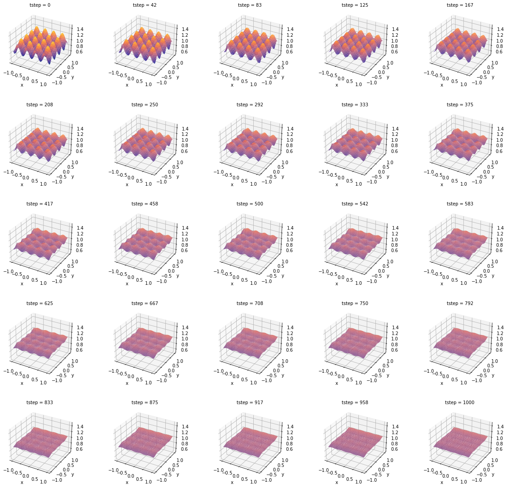

# Heat Transfer equation

This repo contains the final project for the course Scientific Computing in Python.

The equation is:

 $$
\frac{du}{dt} - D \Delta u = 0
 $$

where $u$ is the temperature field, $D$ is the thermal diffusivity, and $\Delta u$ is the heat flux.

This system is solved using the Crank-Nicolson method by defining the following matrices:

$$A = \begin{bmatrix}

    L               & -rI                                               \\
    -\frac{r}{2}I   & L         & -\frac{r}{2}I                         \\
                    & \ddots    & \ddots            & \ddots            \\
                    &           & -\frac{r}{2}I     & L                 & -\frac{r}{2}I \\
                    &           &                   & -rI               & L\\

\end{bmatrix}

\\~\\

L = \begin{bmatrix}

    1+2r & -r\\
    -\frac{r}{2} & 1+2r & -\frac{r}{2}\\
    & \ddots & \ddots & \ddots\\
    &        & -\frac{r}{2} & 1+2r & -\frac{r}{2}\\
    &        &             &  -r   & 1+2r\\

\end{bmatrix}

\\~\\
\\~\\

\hat{B} = \begin{bmatrix}

    Q & rI\\
    \frac{r}{2}I & Q & \frac{r}{2}\\
    &\ddots & \ddots & \ddots\\
    &        & \frac{r}{2}I & Q & \frac{r}{2}\\
    &        &             & rI & Q

\end{bmatrix}

\\~\\

Q = \begin{bmatrix}

    1-2r & r\\
    \frac{r}{2} & 1-2r & \frac{r}{2}\\
    & \ddots & \ddots & \ddots\\
    &        & \frac{r}{2} & 1-2r & \frac{r}{2}\\
    &        &             &  r   & 1-2r\\

\end{bmatrix}
$$

from which the following equation is solved:

$$

Au^{n+1} = Bu^{n}

$$

The time evolution of this system looks as follows:

